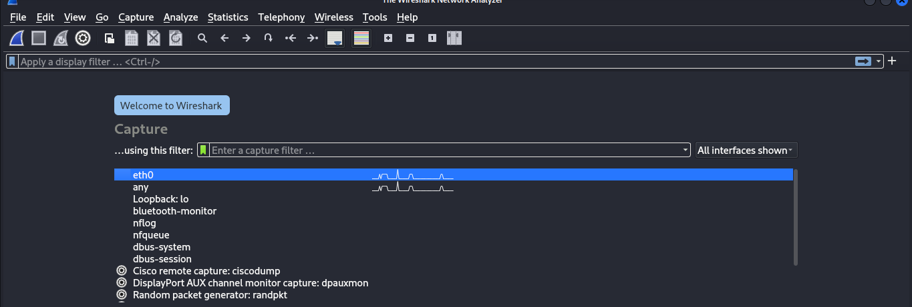
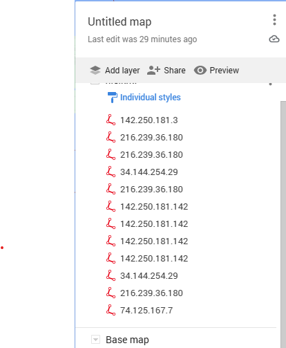

Thanks for sharing your project. Based on your earlier project description and the contents of your ZIP file, here's a **professional `README.md`** file you can include in your GitHub repository:

---

````markdown
# 🌐 Network Traffic Visualization

 | 
:-------------------------:|:-------------------------:
*Figure 1: Wireshark Interface*  |  *Figure 2: Google Maps Visualization*

## 📖 Overview

**Network Traffic Visualization** is a Python-based tool that enables users to analyze `.pcap` files captured via Wireshark and visualize IP traffic on a map using KML (Keyhole Markup Language). This helps users better understand where network traffic originates and terminates by identifying IP address types and mapping them using GeoIP data.

---

## ✨ Features

- 🔍 **Packet Analysis**: Parses `.pcap` files and extracts relevant data using `dpkt`.
- 🧠 **IP Classification**: Differentiates between private, public, and multicast IPs.
- 🌍 **Geo Mapping**: Maps IPs to geographic locations using the GeoLiteCity database.
- 🗺️ **KML File Generation**: Creates KML files that can be opened in Google Earth or Maps.
- 🧩 **Modular Architecture**: Easily extendable for advanced applications like intrusion detection systems (IDS).

---

## 🛠️ Technical Stack

| Component       | Technology Used        |
|-----------------|------------------------|
| Packet Analysis | `dpkt`, `Wireshark`    |
| Geolocation     | `pygeoip`, `GeoLiteCity.dat` |
| Visualization   | KML, Google Earth      |
| Programming     | Python 3.8+            |

---

## 🚀 Getting Started

### ✅ Prerequisites

- Python 3.8 or above
- [Wireshark](https://www.wireshark.org/) for packet capture
- [GeoLiteCity Database](https://dev.maxmind.com/geoip/geolite2-free-geolocation-data)  
  > Download and place `GeoLiteCity.dat` in the root directory of the project.

### 📦 Installation

```bash
git clone https://github.com/saadali112/Network-traffic-visualization.git
cd Network-traffic-visualization
pip install -r requirements.txt
````

---

## 📊 Usage

1. Capture network traffic using Wireshark and save it as a `.pcap` file.
2. Place the `.pcap` file in the project root.
3. Run the script with:

```bash
python3 main.py <your_file.pcap>
```

4. Open the generated `output.kml` with [Google Earth](https://www.google.com/earth/) or any KML viewer.

---


## 🔐 IP Address Categories

* **Private IPs**: Local network addresses (e.g., `192.168.x.x`, `10.x.x.x`)
* **Public IPs**: Routable addresses on the internet
* **Multicast IPs**: Used for broadcasting in subnetworks

These categories are identified and filtered before visualization.

---

## 🧪 Sample Output

* Displays geographic origin and destination of IP packets
* Can be extended to highlight potentially malicious activity

---

## 📌 Use Cases

* Educational demonstrations in networking and cybersecurity
* Basic network forensics
* Geographical traffic visualization for SIEM dashboards

---

## 👨‍💻 Author

**Saad Ali**
Cybersecurity Enthusiast | Python Developer
📧 Contact: [saadali112@example.com](mailto:saadali112@example.com)
🔗 GitHub: [@saadali112](https://github.com/saadali112)

---

## 📄 License

This project is licensed under the [MIT License](LICENSE).

---

## 🤝 Contributions

Contributions, issues, and feature requests are welcome!
Feel free to check the [issues page](https://github.com/saadali112/Network-traffic-visualization/issues).

---

```

---

Let me know if you'd like:

- A sample `LICENSE` file (MIT or another license)
- GitHub badges (for stars, forks, Python version, etc.)
- A `requirements.txt` file regeneration
- GitHub Actions CI setup

Would you like me to write a short section on "Extending the Project" or "Security Considerations" too?
```
